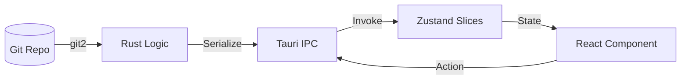

# Architecture Overview
## Version: 1.2.0
## Last updated: 2026-04-11 – v2.1.0 Modular Architecture Sync
## Project: GitKit

GitKit is a high-performance Git client built with Tauri 2, Rust, and React. It follows a domain-scoped, modular architecture with a clear separation between Git logic (Rust) and the user interface (React).

## Technology Stack

### Core
- **Framework**: [Tauri 2](https://tauri.app/) (v2.x)
- **Backend**: [Rust](https://www.rust-lang.org/) (2021 edition) - Modular domain-scoped commands.
- **Frontend**: [React 19](https://react.dev/) + TypeScript + [Vite 7](https://vitejs.dev/) - Sliced state management.
- **Styling**: [Tailwind CSS v4](https://tailwindcss.com/)

### Key Libraries
- **Git Engine**: [git2-rs](https://docs.rs/git2/latest/git2/) (v0.19) - Rust bindings for libgit2.
- **State Management**: [Zustand](https://zustand-demo.pmnd.rs/) (v5.x) - Sliced store architecture for performance and modularity.
- **Virtualization**: [@tanstack/react-virtual](https://tanstack.com/virtual/latest) (v3.x) - For high-performance commit logs.
- **Code Editor**: [@monaco-editor/react](https://github.com/suren-atoyan/monaco-react) (v4.7) - For diff views and conflict resolution.
- **Icons**: [Lucide React](https://lucide.dev/) (v1.x)
- **Encoding**: `encoding_rs` - For multi-encoding file support.

## Directory Structure

```text
├── docs/                   # Documentation files
├── src/                    # Frontend source (React)
│   ├── assets/             # Images and styles
│   ├── components/         # Modular isolated UI units (CommitGraph, RightPanel, etc.)
│   ├── lib/                # Shared utilities (repo.ts, toast.ts, conflictParser.ts)
│   ├── store/              # Zustand store definition
│   │   ├── slices/         # Domain-scoped state slices (repo, log, stash, ui, cherryPick)
│   │   └── index.ts        # Combined store entry point
│   ├── App.tsx             # Main layout and event listeners
│   └── main.tsx            # React entry point
├── src-tauri/              # Backend source (Rust)
│   ├── src/
│   │   ├── commands/       # Domain-scoped Tauri IPC command modules
│   │   │   ├── repo/       # Repository meta, operations, and safe-checkout logic
│   │   │   ├── branch/     # Branch management (listing, creation)
│   │   │   ├── stash/      # Stash lifecycle and advanced stashing
│   │   │   ├── log/        # Commit history and graph topological routing
│   │   │   ├── diff/       # Differential patch generation and blob reading
│   │   │   ├── remote/     # Network operations (fetch, pull, push)
│   │   │   ├── cherry_pick.rs # Cherry-pick state machine and resolution
│   │   │   └── status.rs   # Working tree status and rename tracking
│   │   ├── git/            # Low-level Git operations (git2 wrappers)
│   │   ├── lib.rs          # Tauri initialization and modular registration
│   │   └── main.rs         # Entry point
│   ├── tauri.conf.json     # Tauri configuration
│   └── Cargo.toml          # Rust dependencies
└── package.json            # Frontend dependencies and scripts
```

## Data Flow

GitKit uses a unidirectional data flow from the Git repository (local disk) to the UI.



1.  **State Sync**: UI actions trigger Tauri commands.
2.  **Rust Execution**: Commands use `git2` to interact with the repository. They are organized into domain-specific modules.
3.  **Frontend Update**: Commands return serialized JSON, which the frontend uses to update the relevant **Zustand Slices**.
4.  **Re-render**: React components subscribe to specific state slices to minimize unnecessary re-renders.

## Tauri IPC Commands

Commands are organized into modules in `src-tauri/src/commands/`.

| Domain | Command | Responsibility |
|---|---|---|
| **Repo** | `open_repo`, `get_repo_status`, `checkout_branch`, `safe_checkout` | Metadata, counts, and safe branch switching logic. |
| **Branch**| `list_branches`, `create_branch`, `validate_branch_name` | Branch lifecycle management. |
| **Stash** | `list_stashes`, `create_stash`, `apply_stash`, `pop_stash`, `drop_stash`, `stash_save_advanced` | Stash management and conflict handling. |
| **Log** | `get_log` | Commit history with lane routing. |
| **Diff** | `get_diff`, `get_file_contents`, `create_commit` | Patch generation and commit creation. |
| **Remote**| `fetch_all_remotes`, `pull_remote`, `push_remote` | Network operations with strategy support. |
| **Status**| `get_status` | Working tree status with rename tracking. |
| **CherryPick**| `get_cherry_pick_state`, `cherry_pick_commit`, `cherry_pick_abort` | Cherry-pick workflow and conflict resolution. |

## State Management (Zustand Slices)

The store is split into domains to keep the global state manageable:

- **`RepoSlice`**: `activeRepoPath`, `repoStatus`, file lists (staged/unstaged/untracked).
- **`LogSlice`**: `commitLog`, `selectedCommitDetail`, pagination state.
- **`StashSlice`**: Stash entries and persistent stashing preferences.
- **`UISlice`**: Tabs, navigation, toasts, and modal states.
- **`CherryPickSlice`**: Active cherry-pick operation state and conflict resolution data.

> [!TIP] Integration:
> All slices are recomposed into a unified `AppStore` in `src/store/index.ts`, allowing components to use a single hook `useAppStore` while maintaining internal modularity.
