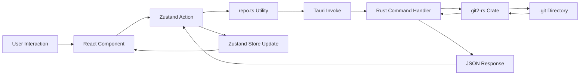

# Architecture
## Version: 3.1.0
## Last updated: 2026-04-21 – System architecture overview, tech stack, and IPC surface.
## Project: GitKit

GitKit is a high-performance Git GUI built with Tauri, React, and Rust. It leverages the `git2` crate for direct repository access and provides a premium, glassmorphic UI for complex Git workflows.

## Tech Stack

| Layer | Technology | Version | Purpose |
|---|---|---|---|
| **Frontend Runtime** | React | 19.1.0 | Component-based UI |
| **Language** | TypeScript | 5.8.3 | Type-safe development |
| **Build Tool** | Vite | 7.0.4 | Fast dev server and bundling |
| **Styling** | Tailwind CSS | 4.2.2 | Utility-first styling with v4 engine |
| **State Management** | Zustand | 5.0.12 | Lightweight global state slices |
| **Framework** | Tauri | 2.0.0 | Native shell and Rust bridge |
| **Git Backend** | git2-rs | 0.19 | Low-level Git operations |
| **Editor** | Monaco Editor | 4.7.0 | High-performance diff and conflict editing |
| **Virtualization** | TanStack Virtual | 3.13.23 | Rendering long commit logs |

## Directory Map

### Root
- [package.json](file:///d:/learn/git-helper/package.json) - Frontend dependencies and scripts
- [vite.config.ts](file:///d:/learn/git-helper/vite.config.ts) - Vite configuration with Tailwind CSS v4 support
- [index.html](file:///d:/learn/git-helper/index.html) - Entry HTML file

### Frontend (`src/`)
- [App.tsx](file:///d:/learn/git-helper/src/App.tsx) - Main application orchestrator with initialization logic
- [main.tsx](file:///d:/learn/git-helper/src/main.tsx) - Entry point with global ErrorBoundary
- [index.css](file:///d:/learn/git-helper/src/index.css) - Global styles and design system tokens
- **`components/`**
    - [CommitGraph.tsx](file:///d:/learn/git-helper/src/components/CommitGraph.tsx) - Virtualized Manhattan-routed commit graph
    - [ConflictEditorView.tsx](file:///d:/learn/git-helper/src/components/ConflictEditorView.tsx) - Multi-pane conflict resolution interface
    - [Sidebar/](file:///d:/learn/git-helper/src/components/Sidebar/) - Repository navigation, branches, and stashes
    - [RightPanel/](file:///d:/learn/git-helper/src/components/RightPanel/) - File status, staging, and commit composition
    - [ui/](file:///d:/learn/git-helper/src/components/ui/) - Reusable UI primitives (Button, Card, Badge, etc.)
- **`store/`**
    - [index.ts](file:///d:/learn/git-helper/src/store/index.ts) - Zustand store composition
    - `slices/` - Modular state slices (repo, log, stash, ui, cherry-pick)
- **`lib/`**
    - [repo.ts](file:///d:/learn/git-helper/src/lib/repo.ts) - High-level bridge to Tauri commands
    - [error.ts](file:///d:/learn/git-helper/src/lib/error.ts) - Global error handling and toast integration

### Backend (`src-tauri/`)
- [Cargo.toml](file:///d:/learn/git-helper/src-tauri/Cargo.toml) - Rust dependencies
- [src/lib.rs](file:///d:/learn/git-helper/src-tauri/src/lib.rs) - Tauri builder and command registration
- **`src/commands/`** - Module-based command handlers
    - `repo/`, `status/`, `diff/`, `branch/`, `stash/`, `remote/`, `log/`, `cherry_pick/`
- **`src/git/`** - Abstraction layer over `git2` crate

## Data Flow

## IPC / API Surface

The following Tauri commands are exposed to the frontend:

| Command | Module | Params | Return Type | Purpose |
|---|---|---|---|---|
| `open_repo` | `repo` | `repoPath: String` | `RepoInfo` | Initializes repo access |
| `get_status` | `status` | `repoPath: String` | `Vec<FileStatus>` | Gets working tree changes |
| `get_log` | `log` | `repoPath: String, ...` | `LogResponse` | Fetched virtualized commit log |
| `get_diff` | `diff` | `repoPath: String, ...` | `String` | Gets git patch for a file |
| `create_commit` | `diff` | `repoPath: String, message: String` | `CommitResult` | Performs a git commit |
| `safe_checkout` | `repo` | `repoPath: String, branch: String` | `SafeCheckoutResult` | Validates checkout safety |
| `get_cherry_pick_state`| `cherry_pick` | `repoPath: String` | `CherryPickInProgress`| Checks for active cherry-pick |

## State Management

The global state is managed by Zustand and split into the following slices:

| Slice | Responsibility | Key State Fields |
|---|---|---|
| `RepoSlice` | Repository metadata and status | `activeRepoPath`, `repoInfo`, `repoStatus`, `branches` |
| `LogSlice` | Commit history and graph data | `commitLog`, `isEndOfLog`, `isLoadingLog` |
| `StashSlice` | Git stashes | `stashes`, `isLoadingStashes` |
| `UISlice` | UI state, tabs, and alerts | `activeTabId`, `selectedDiff`, `toasts`, `isProcessing` |
| `CherryPickSlice`| Active cherry-pick workflow | `cherryPickState`, `conflictVersions` |

> [!NOTE] Undocumented: The interaction between `RefCache` in Rust and the frontend `LogSlice` is implicitly handled via `get_log` but not explicitly synchronized as a push-based system.
