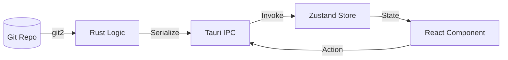

# Architecture Overview
## Version: 1.0.0
## Last updated: 2026-04-09 – Initial architecture document
## Project: GitKit

GitKit is a high-performance Git client built with Tauri 2, Rust, and React. It follows a modular architecture with a clear separation between Git logic (Rust) and the user interface (React).

## Technology Stack

### Core
- **Framework**: [Tauri 2](https://tauri.app/) (v2.x)
- **Backend**: [Rust](https://www.rust-lang.org/) (2021 edition)
- **Frontend**: [React 19](https://react.dev/) + TypeScript + [Vite 7](https://vitejs.dev/)
- **Styling**: [Tailwind CSS v4](https://tailwindcss.com/)

### Key Libraries
- **Git Engine**: [git2-rs](https://docs.rs/git2/latest/git2/) (v0.19) - Rust bindings for libgit2.
- **State Management**: [Zustand](https://zustand-demo.pmnd.rs/) (v5.x) - Single-store architecture.
- **Virtualization**: [@tanstack/react-virtual](https://tanstack.com/virtual/latest) (v3.x) - For high-performance commit logs.
- **Code Editor**: [@monaco-editor/react](https://github.com/suren-atoyan/monaco-react) (v4.7) - For diff views.
- **Icons**: [Lucide React](https://lucide.dev/) (v1.x)
- **Encoding**: `encoding_rs` - For multi-encoding file support.

## Directory Structure

```text
├── docs/                   # Documentation files
├── src/                    # Frontend source (React)
│   ├── assets/             # Images and styles
│   ├── components/         # Modular isolated UI units
│   ├── lib/                # Shared utilities (repo logic, toasts)
│   ├── store/              # Zustand store definition
│   ├── App.tsx             # Main layout and event listeners
│   └── main.tsx            # React entry point
├── src-tauri/              # Backend source (Rust)
│   ├── src/
│   │   ├── commands/       # Tauri IPC command implementations
│   │   ├── git/            # Low-level Git operations (git2 wrappers)
│   │   ├── lib.rs          # Tauri initialization and command registration
│   │   └── main.rs         # Entry point
│   ├── tauri.conf.json     # Tauri configuration
│   └── Cargo.toml          # Rust dependencies
├── memory/                 # Legacy memory system (deprecated in favor of docs/)
└── package.json            # Frontend dependencies and scripts
```

## Data Flow

GitKit uses a unidirectional data flow from the Git repository (local disk) to the UI.



1.  **State Sync**: UI actions trigger Tauri commands.
2.  **Rust Execution**: Commands use `git2` to interact with the repository.
3.  **Frontend Update**: Commands return serialized JSON, which the frontend uses to update the Zustand store.
4.  **Re-render**: React components subscribe to store changes and re-render.

## Tauri IPC Commands

All commands are defined in `src-tauri/src/commands/`.

| Command | Params | Return Type | Responsibility |
|---|---|---|---|
| `open_repo` | `path` | `RepoInfo` | Discovers and validates a Git repo, adds to recent lists. |
| `get_status` | `repo_path` | `Vec<FileStatus>` | Returns flat list of modified/untracked files. |
| `get_repo_status` | `path` | `RepoStatus` | Summary counts (staged, ahead/behind). |
| `get_log` | `repo_path, limit, offset` | `Vec<CommitNode>` | Fetches commit history with lane routing. |
| `get_diff` | `repo_path, path, staged` | `String` | Returns patch string (diff) for a specific file. |
| `get_file_contents`| `repo_path, path, ...` | `FileContents` | Returns old/new content for full diff view. |
| `checkout_branch` | `repo_path, branch, options`| `Result` | Switches branches with conflict handling. |
| `safe_checkout` | `repo_path, branch` | `SafeResult` | Dry-run to check for switch conflicts. |
| `create_commit` | `repo_path, message, amend` | `String` | Creates a new commit or amends HEAD. |
| `stash_save_advanced`| `repo_path, message, ...` | `String` | Detailed stash creation via CLI. |

## Zustand Store

The application state is managed by a single store in `src/store/index.ts`.

### Core State Slices
- **`activeRepoPath`**: The currently open repository.
- **`repoInfo`**: Metadata about the open repository (head branch, state).
- **`commitLog`**: The virtualized list of commit nodes for the graph.
- **`stagedFiles` / `unstagedFiles`**: Lists derived from `get_status`.
- **`selectedDiff`**: Tracked file/commit currently shown in the center panel.

> [!NOTE] Undocumented:
> The lane assignment for the commit graph is currently handled entirely on the Rust side within the `get_log` command to minimize IPC payload and maximize calculation speed.
