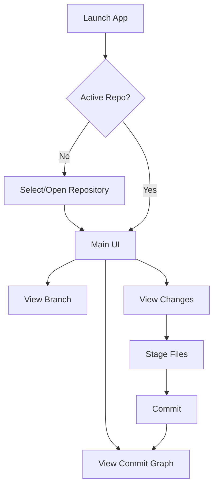

# User Flow
## Version: 0.1.0
## Last updated: 2026-04-05 - Initial project scaffold
## Project: GitKit

```mermaid
flowchart TD
    A[Launch App] --> B{Active Repo?}
    B -- No --> C[Select/Open Repository]
    C --> D[Main UI]
    B -- Yes --> D

    D --> E[View Branch]
    D --> F[View Changes]
    D --> G[View Commit Graph]

    F --> H[Stage Files]
    H --> I[Commit]
    I --> G
```
