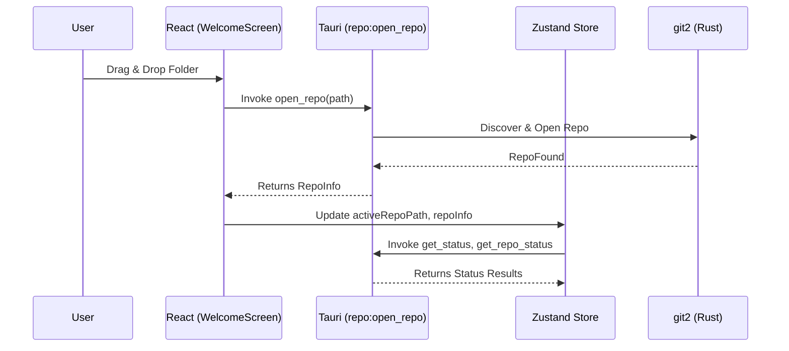
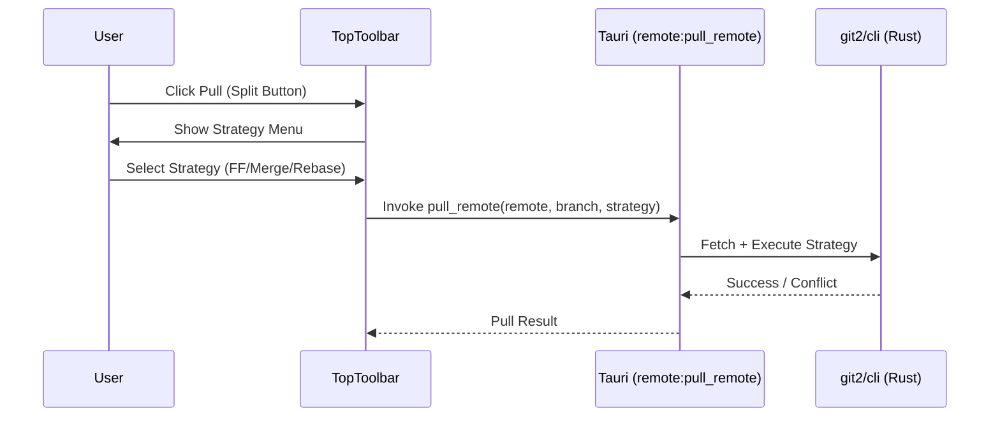
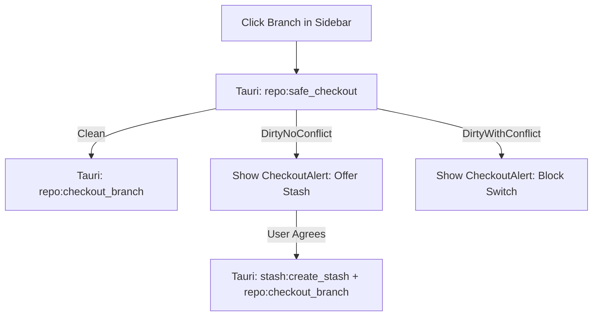
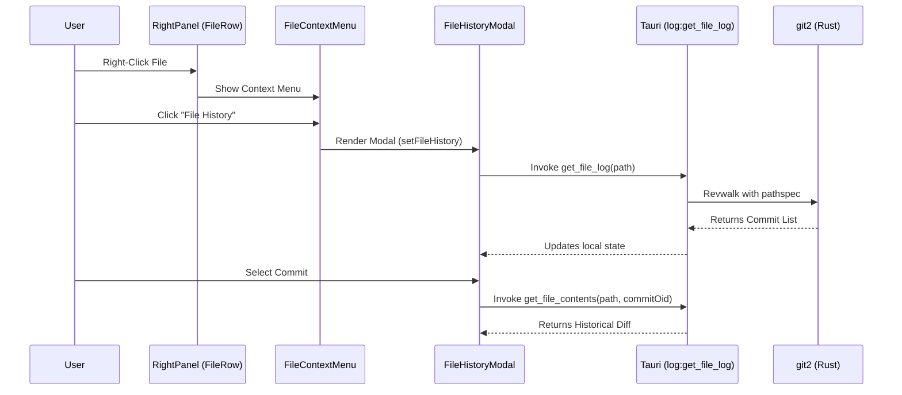

# User Flow & Interaction Map
## Version: 1.1.0
## Last updated: 2026-04-11 – v2.1.0 Flow Sync
## Project: GitKit

This document maps user actions in the UI to their corresponding Tauri commands and state updates.

## 1. Repository Lifecycle

## 2. Pull with Strategy

## 3. Cherry-Pick Workflow

## 4. Branch Management (Safe Checkout)

## 5. File History & Operations

## 6. Interaction Mapping

| UI Action | Tauri Command | Store update | UI Component |
|---|---|---|---|
| Open Folder | `open_repo` | `activeRepoPath`, `repoInfo` | `WelcomeScreen` |
| Pull (FF/Merge/Rebase)| `pull_remote` | `repoStatus`, `commitLog` | `TopToolbar` |
| Cherry-pick | `cherry_pick_commit` | `cherryPickState` | `CommitContextMenu` |
| Resolve Conflict | `resolve_conflict_file`| `cherryPickState` | `ConflictEditorView` |
| Open File History | `get_file_log` | `showFileHistoryModal` | `FileContextMenu` |
| Discard File | `discard_file_changes` | `repoStatus` | `FileContextMenu` |
| Stage File | `stage_file` | `stagedFiles`, `unstagedFiles` | `RightPanel` |

## 7. View States logic

- **`activeTabId === 'home'`**: Shows `WelcomeScreen`.
- **`showFileHistoryModal === true`**: Shows `FileHistoryModal` overlay.
- **`selectedDiff !== null`**: Overlays `MainDiffView` (Monaco) over the `CommitGraph`.
- **`cherryPickState.status === 'conflicting'`**: Shows `CherryPickBanner`.
- **`isLoadingRepo === true`**: Global spinner overlay.
