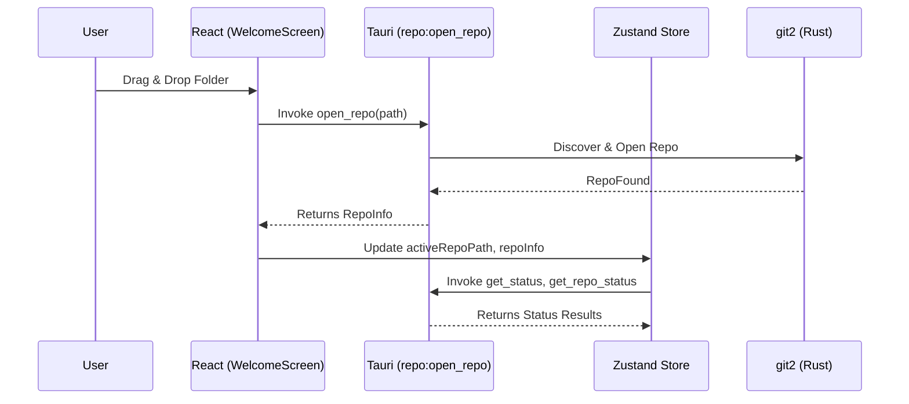
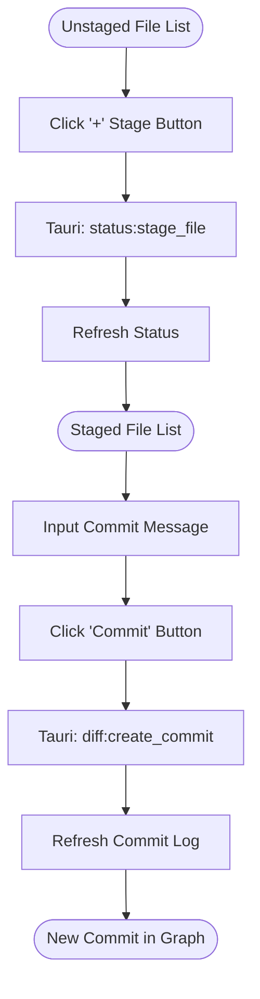

# User Flow & Interaction Map
## Version: 1.0.0
## Last updated: 2026-04-09 – Initial flow document
## Project: GitKit

This document maps user actions in the UI to their corresponding Tauri commands and state updates.

## 1. Repository Lifecycle

## 2. Staging & Committing

## 3. Branch Management (Safe Checkout)

## 4. Interaction Mapping

| UI Action | Tauri Command | Store update | UI Component |
|---|---|---|---|
| Open Folder | `open_repo` | `activeRepoPath`, `repoInfo` | `WelcomeScreen` |
| Hover Commit | `get_commit_detail` | `selectedCommitDetail` | `CommitGraph` |
| Stage File | `stage_file` | `stagedFiles`, `unstagedFiles` | `RightPanel` |
| Change Branch | `checkout_branch` | `activeBranch`, `commitLog` | `Sidebar` |
| Fetch Remote | `fetch_remote` | `repoStatus` (ahead/behind) | `TopToolbar` |
| Create Stash | `stash_save_advanced`| `stashes`, `commitLog` | `CreateStashDialog`|

## 5. View States logic

- **`activeTabId === 'home'`**: Shows `WelcomeScreen`.
- **`selectedDiff !== null`**: Overlays `MainDiffView` (Monaco) over the `CommitGraph`.
- **`isLoadingRepo === true`**: Global spinner overlay.
