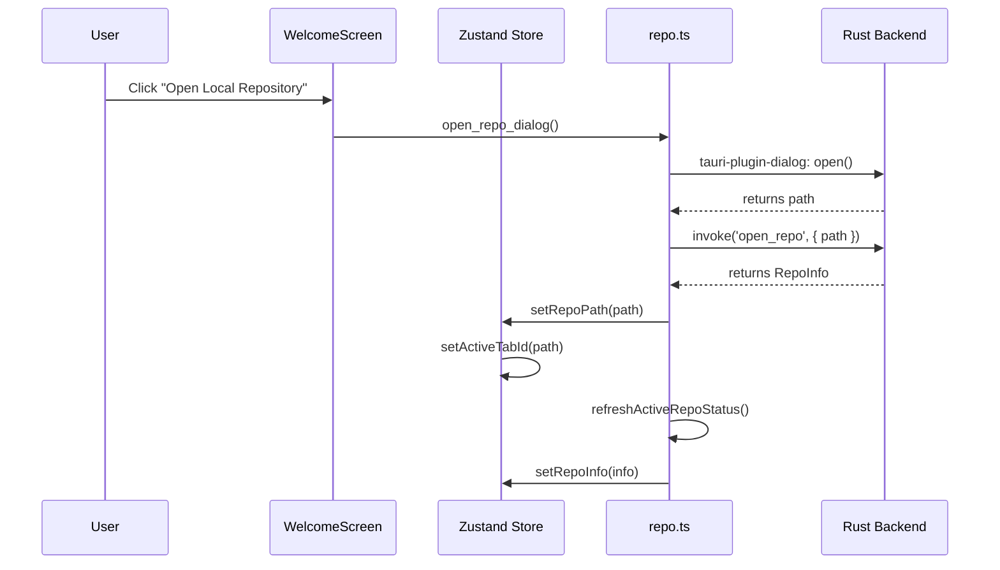
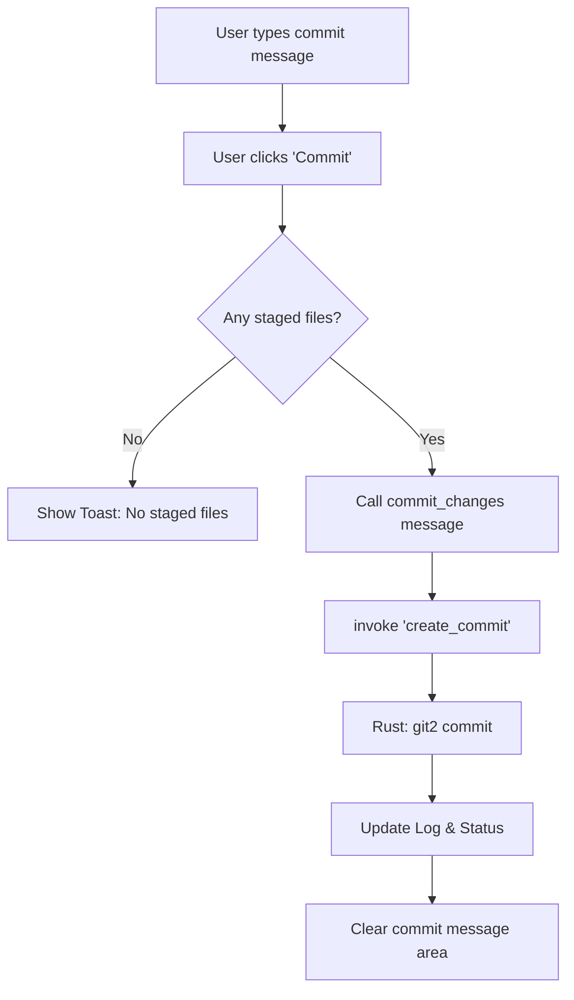
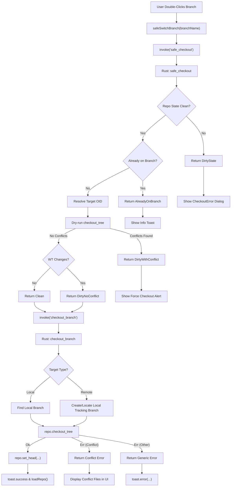
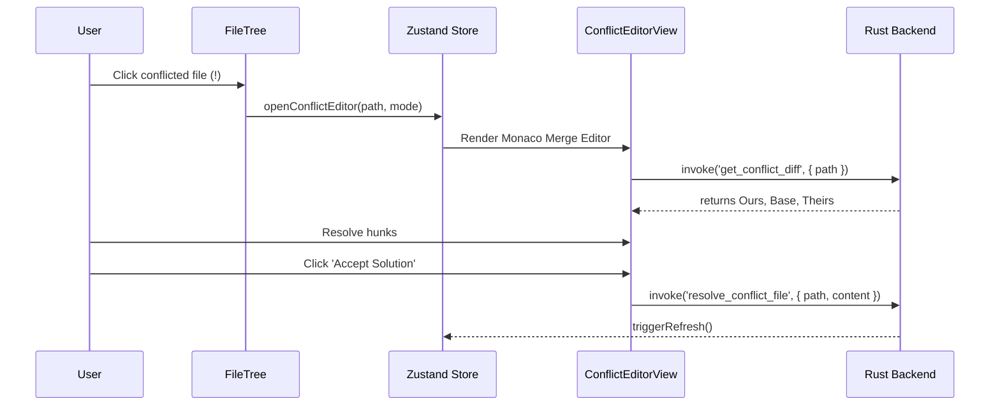
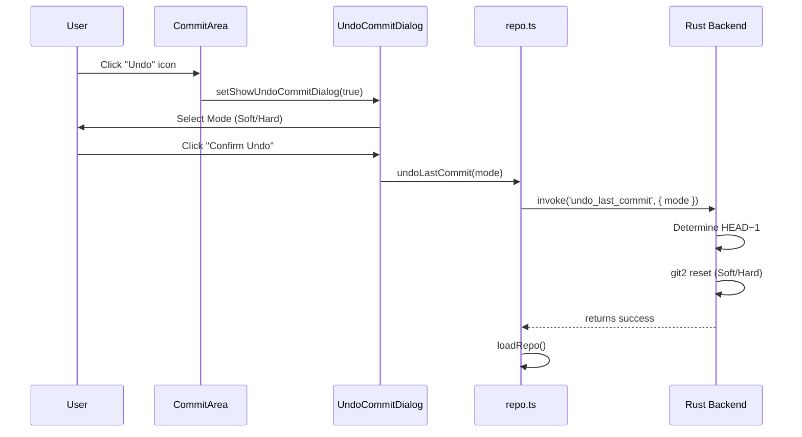

# User Flows
## Version: 3.5.0
## Last updated: 2026-04-29 – Added Undo Commit and Rebase Branch Resolution flows.
## Project: GitKit

This document maps user interactions to state changes and backend operations.

## Opening a Repository



## Committing Changes



## Switching Branches (Checkout)

### Flow Description
This flow describes the process of switching from the current branch to a target branch (local or remote). The application implements a "safe" checkout strategy: it first validates the repository state and potential conflicts via a dry-run (`safe_checkout`) before committing to the actual operation (`checkout_branch`). This prevents the working directory from entering a partially-updated or corrupted state due to unforeseen conflicts.

### IPC Contract

#### 1. `safe_checkout` (Validation)
- **Method**: `invoke('safe_checkout', { repoPath, branchName })`
- **Request Payload**:
  ```typescript
  {
    repoPath: string;
    branchName: string;
  }
  ```
- **Success Response**: `SafeCheckoutResult`
  ```typescript
  type SafeCheckoutResult = 
    | { action: 'AlreadyOnBranch' }
    | { action: 'Clean' }
    | { action: 'DirtyNoConflict' }
    | { action: 'DirtyWithConflict', files: string[] }
    | { action: 'DirtyState', state: string }
    | { action: 'NotFound', branch: string };
  ```

#### 2. `checkout_branch` (Execution)
- **Method**: `invoke('checkout_branch', { repoPath, branchName, options })`
- **Request Payload**:
  ```typescript
  {
    repoPath: string;
    branchName: string;
    options: {
      force: boolean;
      merge: boolean;
      create: boolean;
    };
  }
  ```
- **Error Types**: `CheckoutError`
  ```typescript
  type CheckoutError = 
    | { type: 'Conflict', data: { files: string[] } }
    | { type: 'DirtyState', data: { state: string } }
    | { type: 'NotFound', data: { branch: string } }
    | { type: 'DetachedHead', data: { oid: string } }
    | { type: 'Generic', data: { message: string } };
  ```

### Mermaid Diagram



## Conflict Resolution Workflow



## Undo Last Commit



## Branch Resolution (Rebase State)

This flow ensures the UI displays the original branch name even when Git is in a detached HEAD state during a rebase.

```mermaid
flowchart TD
    A[Refresh Trigger: loadRepo / refresh] --> B[Invoke open_repo / get_repo_status]
    B --> C[Rust: resolve_head_branch]
    C --> D{Check repo.state()}
    D -- "Rebase/Merge" --> E[Read .git/rebase-merge/head-name]
    D -- "Standard Rebase" --> F[Read .git/rebase-apply/head-name]
    D -- "Clean" --> G[repo.head().shorthand()]
    
    E --> H[Strip 'refs/heads/']
    F --> H
    G --> I[Return Branch Name]
    H --> I
    I --> J[Frontend: Update activeBranch & repoInfo]
```
