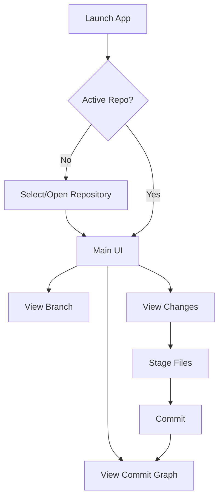
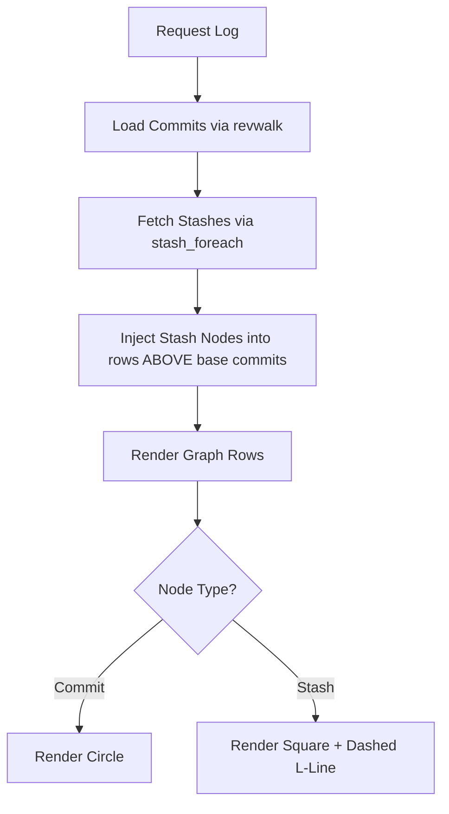

# User Flow
## Version: 1.2.0
## Last updated: 2026-04-09 – Added Inline Stash Visualization
## Project: GitKit

### General App Flow

```mermaid
flowchart TD
    A[Launch App] --> B{Active Repo?}
    B -- No --> C[Select/Open Repository]
    C --> D[Main UI]
    B -- Yes --> D

    D --> E[View Branch]
    D --> F[View Changes]
    D --> G[View Commit Graph]

    F --> H[Stage Files]
    H --> I[Commit]
    I --> G
```

### Stash Visualization Flow

```mermaid
flowchart TD
    G[Request Log] --> L[Load Commits via revwalk]
    L --> S[Fetch Stashes via stash_foreach]
    S --> J[Inject Stash Nodes into rows ABOVE base commits]
    J --> R[Render Graph Rows]
    R --> N{Node Type?}
    N -- Commit --> Circle[Render Circle]
    N -- Stash --> Square[Render Square + Dashed L-Line]
```
