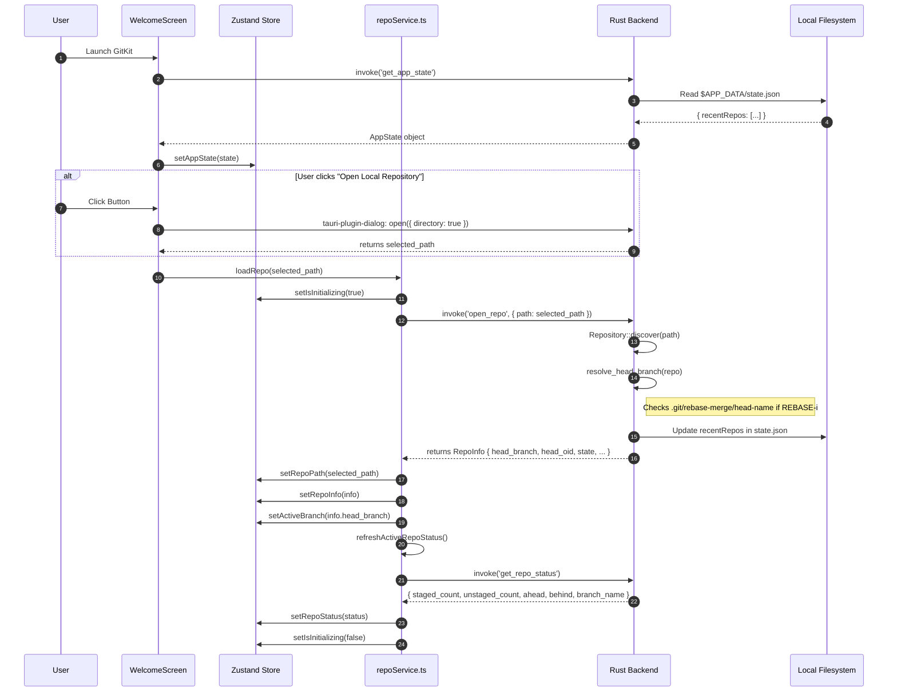
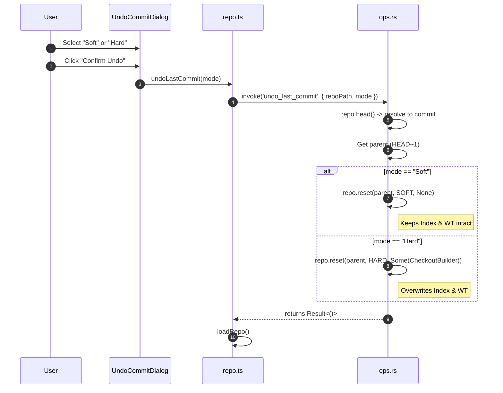
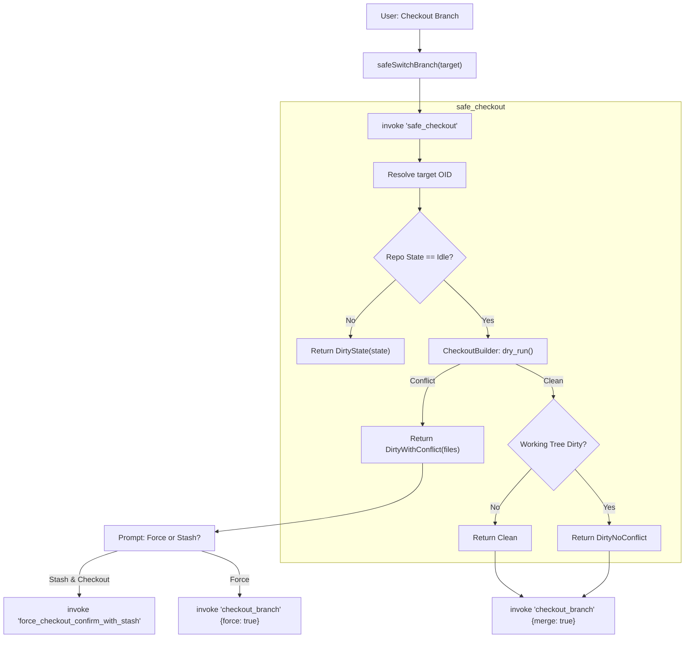
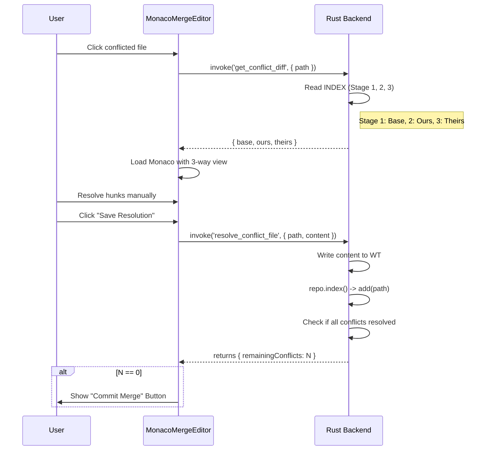

# User Flows: Technical Deep Dive
## Version: 5.1.0
## Last updated: 2026-04-29 – Added Partial Staging (Hunk Staging) Flow.
## Project: GitKit

This document provides a low-level mapping of user actions to system behaviors, including IPC contracts, Rust backend logic, and frontend state management.

---

## 1. Repository Lifecycle & State Restoration

### High-Detail sequence: Opening a Repository


---

## 2. Commit & Rollback Lifecycle

### Technical Flow: Create Commit
```mermaid
flowchart TD
    subgraph Frontend [UI: CommitArea.tsx]
        A[User Input] --> B{Message Empty?}
        B -- "Yes" --> C[toast.error('Please enter message')]
        B -- "No" --> D{Staged Files > 0?}
        D -- "No" --> E[toast.error('No changes staged')]
        D -- "Yes" --> F[invoke 'create_commit' {message}]
    end

    subgraph Backend [Rust: diff.rs]
        F --> G[repo.index()]
        G --> H[index.write_tree()]
        H --> I[Get HEAD OID as Parent]
        I --> J[repo.signature()]
        J --> K[repo.commit(HEAD, author, committer, msg, tree, [parents])]
        K --> L{Result?}
        L -- "Ok" --> M[Return Success]
        L -- "Err" --> N[Return Error Message]
    end

    subgraph Refresh [Lifecycle]
        M --> O[Clear Message Input]
        O --> P[loadRepo() - Full Refresh]
        N --> Q[toast.error(err)]
    end
```

### Technical Flow: Undo Last Commit (Soft/Hard Reset)


---

## 3. Advanced Branching: "Safe Checkout"

GitKit implements a multi-stage checkout to prevent data loss.

### Data Contract: `SafeCheckoutResult`
| Value | Interpretation | UI Action |
|---|---|---|
| `AlreadyOnBranch` | HEAD already points here | Info Toast |
| `Clean` | No uncommitted changes | Immediate Checkout |
| `DirtyNoConflict` | WT changes exist but don't overlap | Checkout with Merge |
| `DirtyWithConflict` | WT changes overlap with target branch | Show Conflict Alert (Force/Stash) |
| `DirtyState` | Repo is in Merge/Rebase/Bisect | Show Error Dialog |

### Execution Flow


---

## 4. Conflict Resolution & Merge Editor

### Interactive Merge sequence


---

## 5. Rebase Branch Name Resolution (Deep State)

How GitKit maintains identity during `Detached HEAD` states.

```mermaid
graph TD
    Trigger["Repo Refresh"] --> Resolve["resolve_head_branch(repo)"]
    Resolve --> State{"repo.state()"}
    
    State -- "RebaseInteractive" --> PathMerge[".git/rebase-merge/head-name"]
    State -- "Rebase" --> PathApply[".git/rebase-apply/head-name"]
    State -- "Merge" --> PathMergeMsg[".git/MERGE_MSG"]
    State -- "Idle" --> Standard["repo.head().shorthand()"]
    
    PathMerge --> Read["fs::read_to_string()"]
    PathApply --> Read
    
    Read --> Clean["Strip 'refs/heads/' prefix"]
    Clean --> Result["Branch: 'feature/login'"]
    Standard --> Result
    
    Result --> Store["useAppStore.setActiveBranch(name)"]

---

## 6. Partial Staging (Hunk Staging)

Technical flow for staging specific code blocks (hunks) from the Diff View.

### Technical Sequence
```mermaid
sequenceDiagram
    autonumber
    participant User
    participant Diff as MainDiffView.tsx
    participant Utils as patch-generator.ts
    participant Backend as status.rs
    participant Git as git2-rs

    User->>Diff: Click "Plus" icon in Gutter (Line N)
    Diff->>Diff: Identify Hunk containing Line N
    Diff->>Utils: generateHunkPatch(options, hunkInfo)
    
    Note over Utils: Constructs Git Patch string:
    Note over Utils: --- a/file.ts \n +++ b/file.ts \n @@ -L,C +L,C @@
    
    Utils-->>Diff: returns patchString
    Diff->>Backend: invoke('apply_patch', { repoPath, patchString })
    
    Backend->>Git: Diff::from_buffer(patchString)
    Backend->>Git: repo.apply(diff, ApplyLocation::Index, None)
    
    Note right of Git: Updates Index without touching Working Tree
    
    Git-->>Backend: Result<()>
    Backend-->>Diff: Success
    Diff->>Diff: toast.success()
    Diff->>Diff: refreshStatus()
```
```
