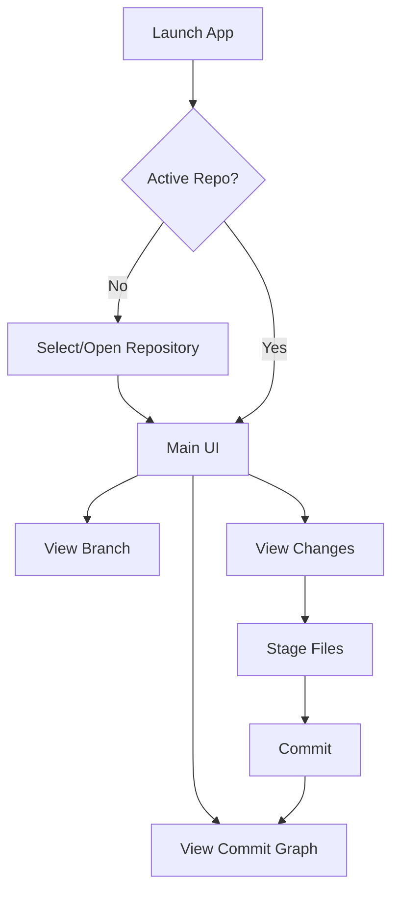
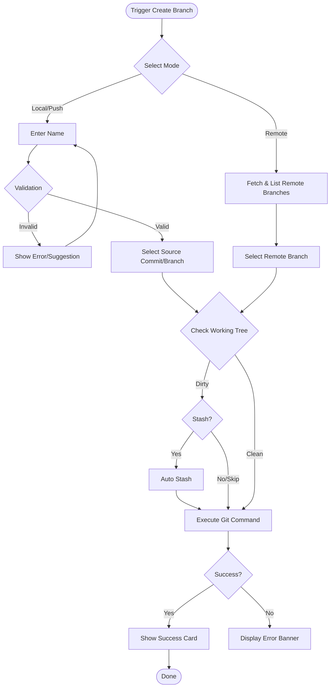

# User Flow
## Version: 1.1.0
## Last updated: 2026-04-09 – Added Advanced Branching System
## Project: GitKit

### General App Flow

```mermaid
flowchart TD
    A[Launch App] --> B{Active Repo?}
    B -- No --> C[Select/Open Repository]
    C --> D[Main UI]
    B -- Yes --> D

    D --> E[View Branch]
    D --> F[View Changes]
    D --> G[View Commit Graph]

    F --> H[Stage Files]
    H --> I[Commit]
    I --> G
```

### Branch Creation Flow

```mermaid
flowchart TD
    Start([Trigger Create Branch]) --> Mode{Select Mode}
    
    Mode -- Local/Push --> Input[Enter Name]
    Input --> Valid{Validation}
    Valid -- Invalid --> Suggest[Show Error/Suggestion]
    Suggest --> Input
    Valid -- Valid --> Source[Select Source Commit/Branch]
    Source --> CheckTree{Check Working Tree}
    
    Mode -- Remote --> Fetch[Fetch & List Remote Branches]
    Fetch --> SelectR[Select Remote Branch]
    SelectR --> CheckTree
    
    CheckTree -- Dirty --> Stash{Stash?}
    Stash -- Yes --> AutoStash[Auto Stash]
    AutoStash --> Execute
    Stash -- No/Skip --> Execute
    CheckTree -- Clean --> Execute
    
    Execute[Execute Git Command] --> Result{Success?}
    Result -- Yes --> SuccessCard[Show Success Card]
    Result -- No --> ErrorMsg[Display Error Banner]
    
    SuccessCard --> Finish([Done])
```
