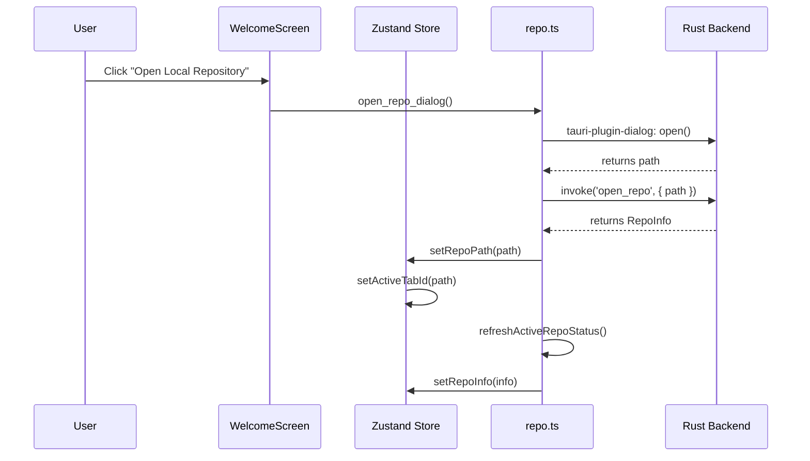
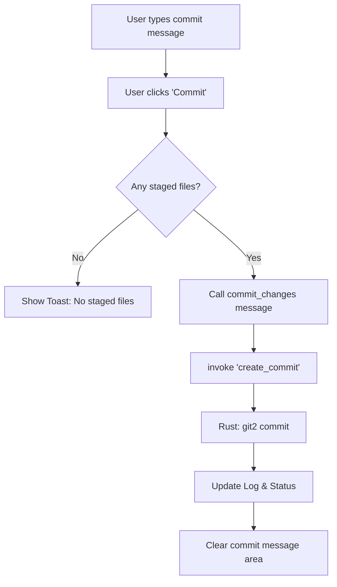
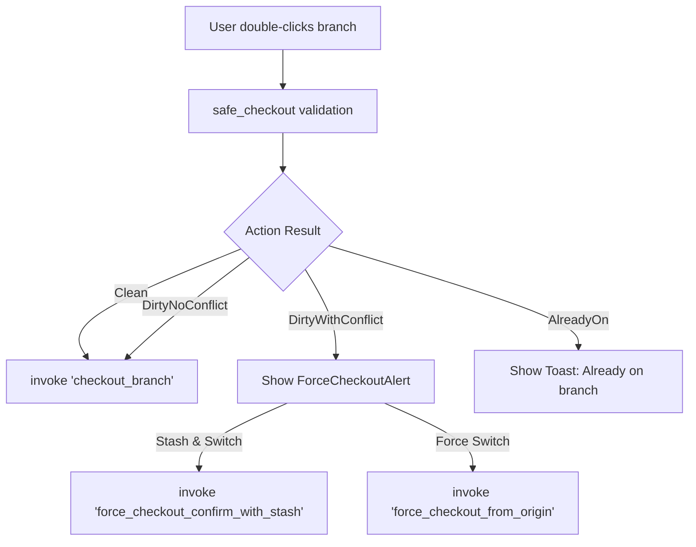
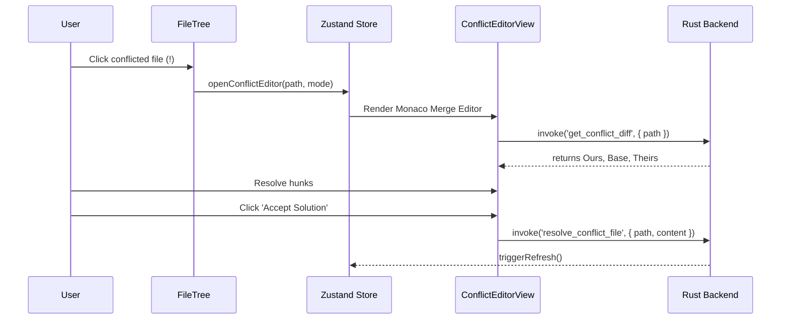

# User Flows
## Version: 3.4.0
## Last updated: 2026-04-22 – High-Fidelity UI Modernization & Stability Hardening.
## Project: GitKit

This document maps user interactions to state changes and backend operations.

## Opening a Repository

## Committing Changes

## Switching Branches

## Conflict Resolution Workflow

