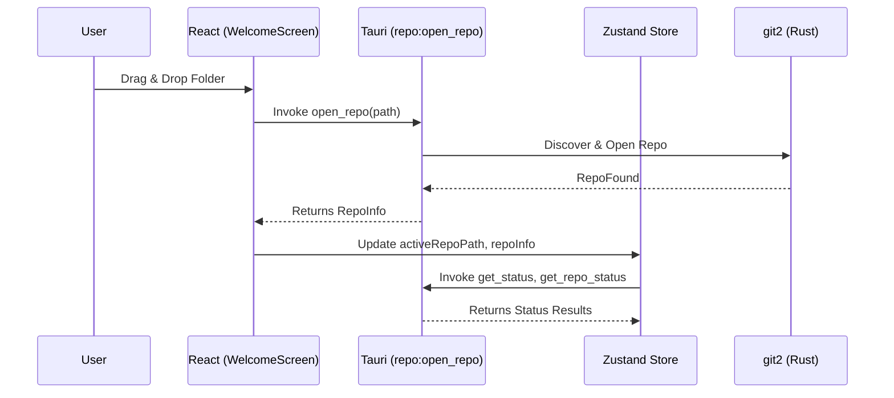
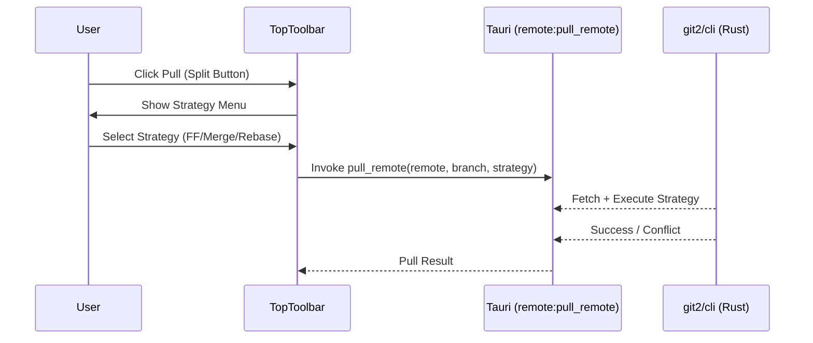
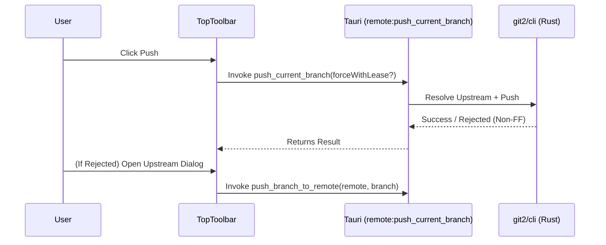
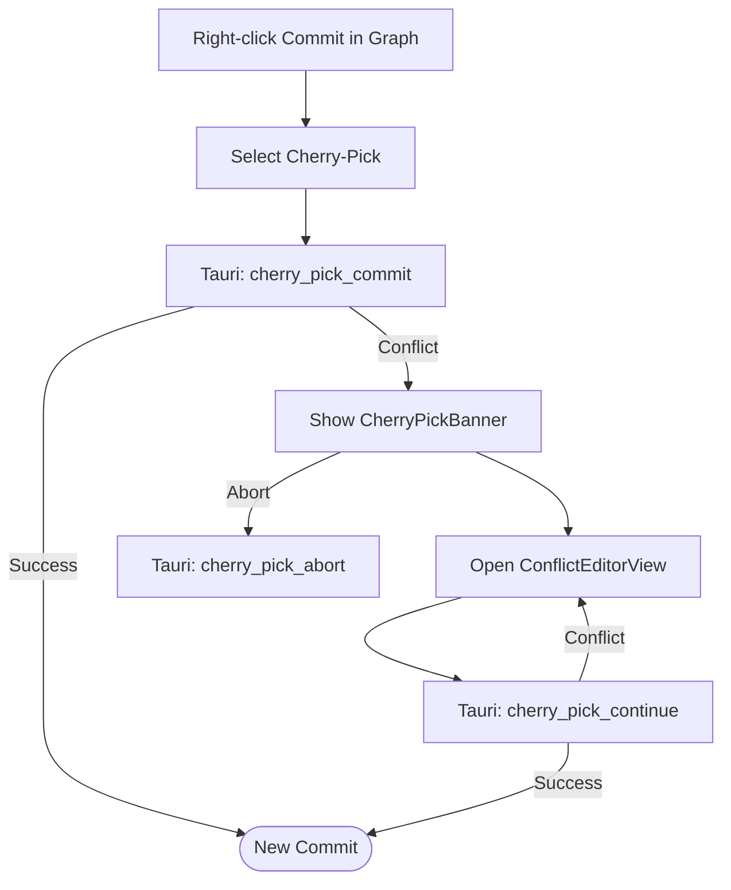
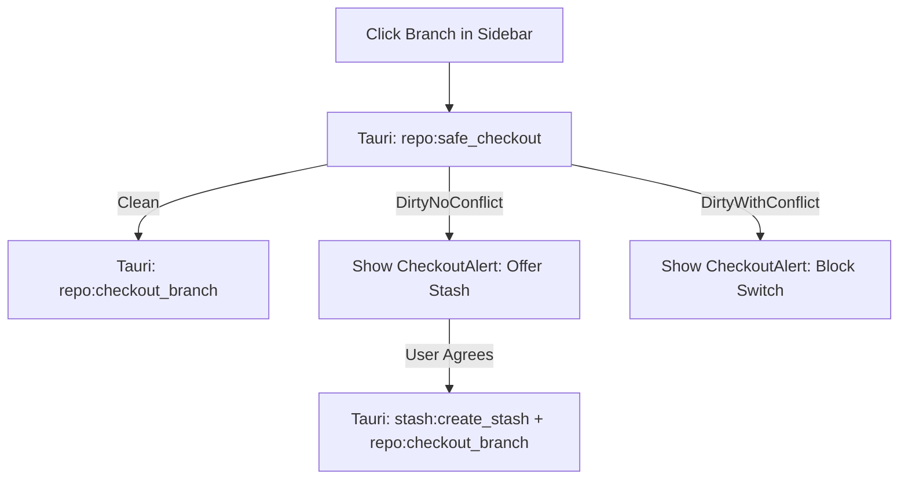
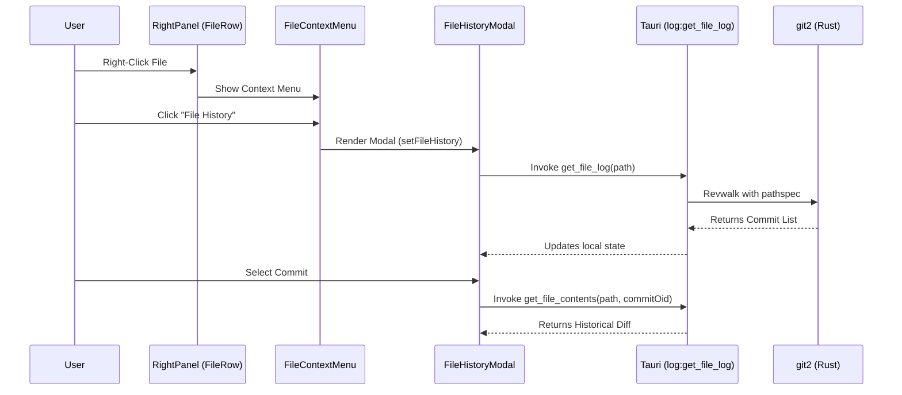
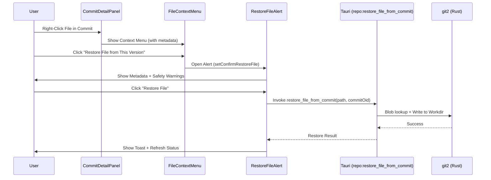
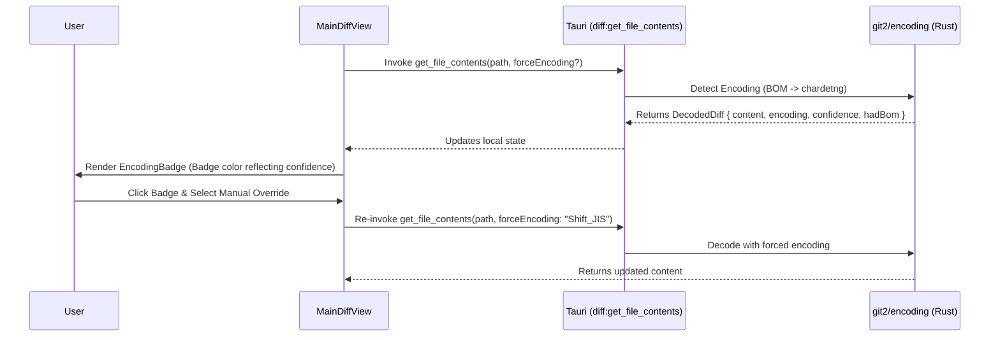

# User Flow & Interaction Map
## Version: 2.7.0
## Last updated: 2026-04-11 – v2.7.0 Restore File & Push Sync
## Project: GitKit

This document maps user actions in the UI to their corresponding Tauri commands and state updates.

## 1. Repository Lifecycle

## 2. Pull with Strategy

## 3. Push Workflow (Safe Push)

## 4. Cherry-Pick Workflow

## 4. Branch Management (Safe Checkout)

## 5. File History & Operations

## 6. Restore File from Version

## 7. Auto Encoding Detection & Override

## 8. Interaction Mapping

| UI Action | Tauri Command | Store update | UI Component |
|---|---|---|---|
| Open Folder | `open_repo` | `activeRepoPath`, `repoInfo` | `WelcomeScreen` |
| Pull (FF/Merge/Rebase)| `pull_remote` | `repoStatus`, `commitLog` | `TopToolbar` |
| Push | `push_current_branch` | `repoStatus`, `commitLog` | `TopToolbar` |
| Cherry-pick | `cherry_pick_commit` | `cherryPickState` | `CommitContextMenu` |
| Resolve Conflict | `resolve_conflict_file`| `cherryPickState` | `ConflictEditorView` |
| Open File History | `get_file_log` | `showFileHistoryModal` | `FileContextMenu` |
| Restore File | `restore_file_from_commit`| `repoStatus` | `RestoreFileAlert` |
| Discard File | `discard_file_changes` | `repoStatus` | `FileContextMenu` |
| Stage File | `stage_file` | `stagedFiles`, `unstagedFiles` | `RightPanel` |
| Override Encoding | `get_file_contents` | (local component state) | `EncodingBadge` |

## 9. View States logic

- **`activeTabId === 'home'`**: Shows `WelcomeScreen`.
- **`showFileHistoryModal === true`**: Shows `FileHistoryModal` overlay.
- **`selectedDiff !== null`**: Overlays `MainDiffView` (Monaco) over the `CommitGraph`.
- **`cherryPickState.status === 'conflicting'`**: Shows `CherryPickBanner`.
- **`isLoadingRepo === true`**: Global spinner overlay.
