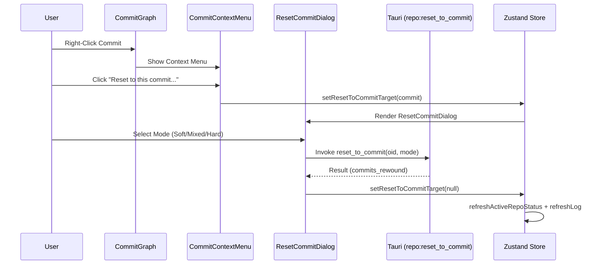
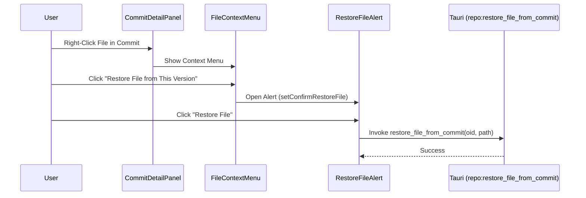
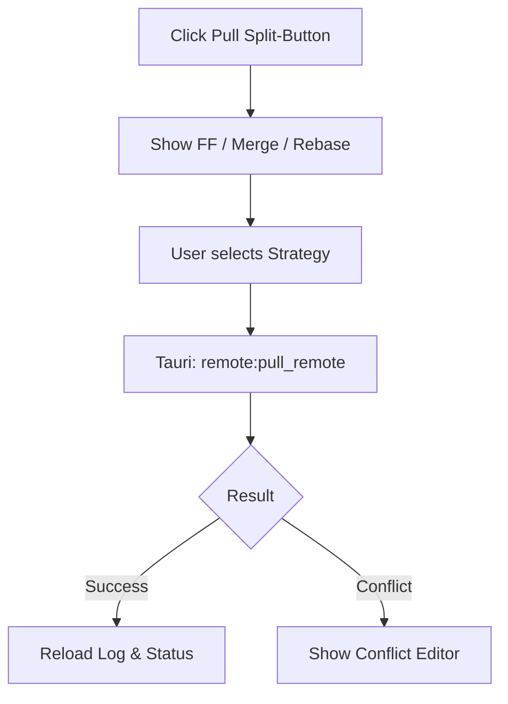

# User Flow & Interaction Map
## Version: 2.10.1
## Last updated: 2026-04-12 – Documenting Git Reset and File Restore flows.
## Project: GitKit

This document maps user actions in the UI to their corresponding Tauri commands and state updates.

## 1. Git Reset Workflow

## 2. File Restore Workflow

## 3. Pull Strategy Workflow

## 4. Interaction Mapping

| UI Action | Trigger Component | Tauri Command | Store Update |
|---|---|---|---|
| Reset to Commit | `CommitContextMenu` | `reset_to_commit` | `resetToCommitTarget`, `commitLog` |
| Restore File | `FileContextMenu` | `restore_file_from_commit` | `repoStatus` |
| Stage File | `RightPanel` | `stage_file` | `stagedFiles`, `unstagedFiles` |
| Safe Checkout | `Sidebar` | `safe_checkout` | `activeBranch`, `commitLog` |
| Cherry-pick | `CommitContextMenu` | `cherry_pick_commit` | `cherryPickState` |
| Save Stash | `TopToolbar` | `stash_save_advanced` | `stashEntries` |
| Fetch All | `TopToolbar` | `fetch_all_remotes` | `repoStatus`, `commitLog` |

## 5. View States Logic

- **`activeTabId === 'home'`**: Shows `WelcomeScreen`.
- **`resetToCommitTarget !== null`**: Overlays `ResetCommitDialog`.
- **`showFileHistoryModal === true`**: Overlays `FileHistoryModal`.
- **`selectedDiff !== null`**: Overlays `MainDiffView` (Monaco).
- **`isLoadingRepo === true`**: Displays global linear progress/spinner.
